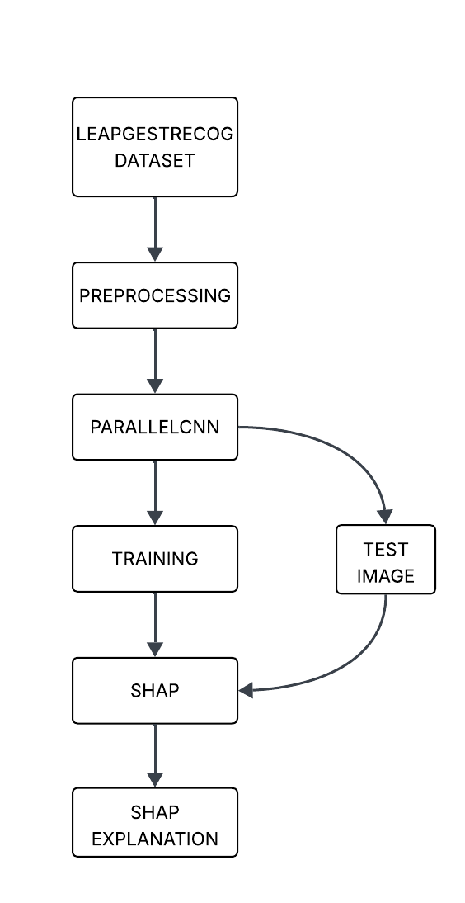
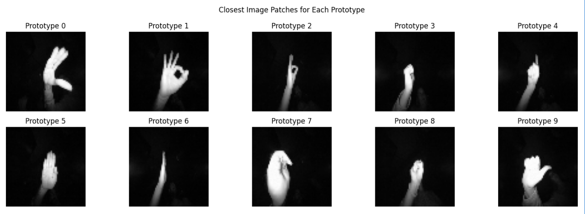
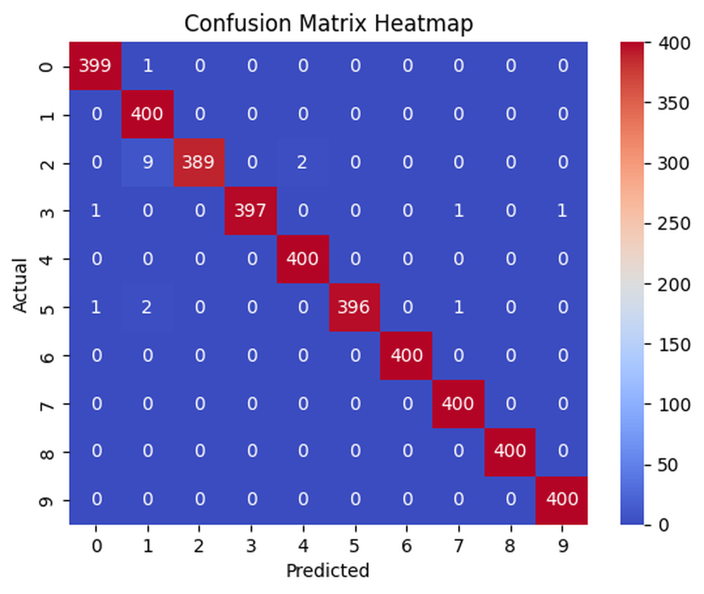
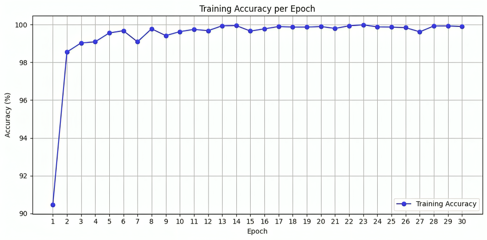
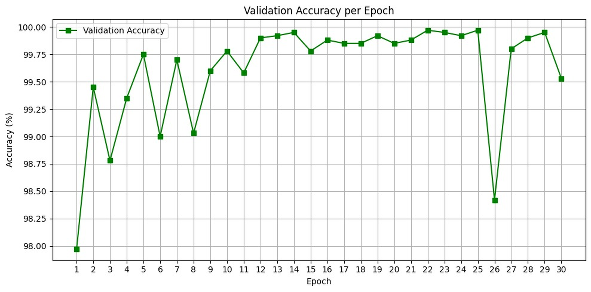
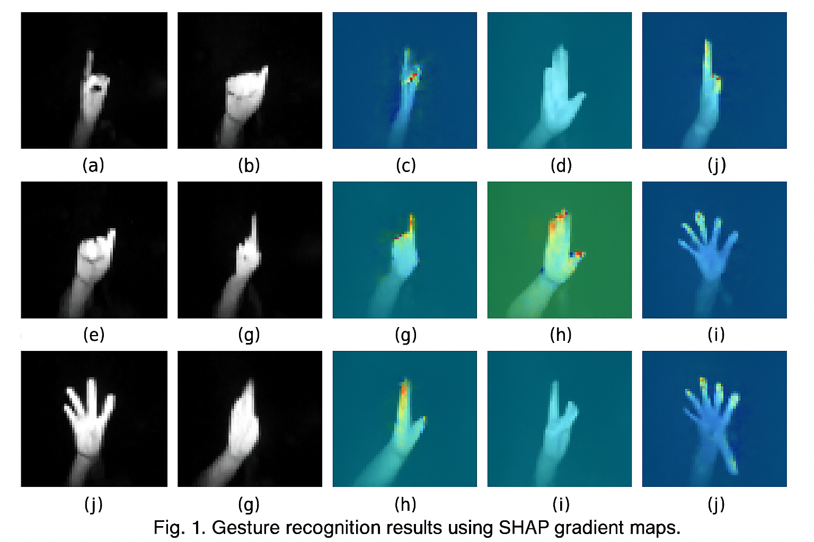

# Explainable Hand Gesture Recognition using SHAP-Enhanced ParallelCNN

> MANIT Bhopal – Summer Internship Project · LeapGestRecog · PyTorch · XAI (SHAP)

This project implements a lightweight **ParallelCNN** for static hand-gesture recognition on **LeapGestRecog**, and pairs it with **SHAP** to generate pixel-level attribution maps.  
On our setup, the model reached **~99.5% validation** and **>99% test** accuracy, while explanations consistently highlighted finger contours and palm regions that drive predictions.  
The repo contains the fully computed notebook, exported figures, and minimal code so others can view results quickly and re-run locally.
<!-- Badges -->

  
  
  

**Quick links:**  
- 📓 Notebook: [`notebooks/Parallel_CNN.ipynb`](notebooks/Parallel_CNN.ipynb)  
- 🧩 Confusion Matrix: [`results/confusion_matrix.png`](results/confusion_matrix.png)  
- 📈 Training Curve: [`results/train_accuracy.png`](results/train_accuracy.png)  
- ✅ Validation Curve: [`results/val_accuracy.png`](results/val_accuracy.png)  
- 🔬 Saliency Grid: [`results/shap_examples/shap_grid_01.png`](results/shap_examples/shap_grid_01.png)  
- 🏗️ Architecture: [`assets/fig_architecture.png`](assets/fig_architecture.png)
les/shap_grid_01.png" alt="SHAP/IG Saliency Grid" width="420">

## 🔧 Workflow

*Figure 1 — End-to-end pipeline. Depth frames from LeapGestRecog are preprocessed, fed to the ParallelCNN for training/evaluation, and then explained with SHAP/IG to highlight pixels that drive each prediction.*

---

## 🧱 Architecture

*Figure 2 — ParallelCNN. Two convolutional branches (3×3 and 5×5) extract complementary features. Feature maps are concatenated and passed to a compact classifier head.*

---

## 🖼️ Dataset Samples

*Figure 3 — LeapGestRecog samples. Example depth frames across the 10 gesture classes used in this project.*

---

## 📊 Results

**Numbers:** see [`results/metrics.json`](results/metrics.json)

### 1) Confusion Matrix

*Figure 4 — Nearly all mass is on the diagonal, indicating very high per-class accuracy with only a few minor off-diagonal mistakes.*

### 2) Training Accuracy

*Figure 5 — Training accuracy climbs rapidly and plateaus around ~99–100%.*

### 3) Validation Accuracy

*Figure 6 — Validation accuracy remains ~99% with small fluctuations, suggesting good generalization for this dataset.*

### 4) Saliency / SHAP Grid

*Figure 7 — Attribution heatmaps consistently highlight finger tips and palm edges that are discriminative for the predicted gesture.*
